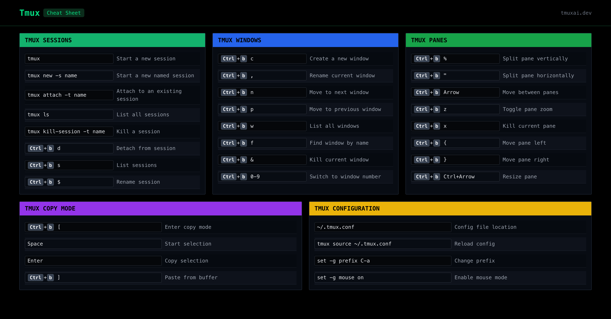

# Tmux Configuration

Minimal tmux setup optimized for macOS + iTerm2 with Neovim true color support.

## Requirements

- tmux >= 3.1

## Installation

```bash
mkdir -p ~/.config/tmux
# Place tmux.conf in this directory, then start tmux
tmux
```

---

## Keymaps

### Cheat Sheets

> **Note:** Pane resize shortcuts are customized — macOS Mission Control intercepts the default `Ctrl+Arrow` bindings, so `H/J/K/L` is used instead.



> Prefix key is the default: `Ctrl+b`

### Pane Management

| Shortcut         | Action                                             |
| ---------------- | -------------------------------------------------- |
| `Ctrl+b` `"`     | Split pane horizontally (top / bottom) _(default)_ |
| `Ctrl+b` `%`     | Split pane vertically (side by side) _(default)_   |
| `Ctrl+b` `x`     | Kill current pane                                  |
| `Ctrl+b` `z`     | Zoom / unzoom current pane (fullscreen toggle)     |
| `Ctrl+b` `q`     | Show pane numbers                                  |
| `Ctrl+b` `Space` | Cycle pane layouts                                 |

### Pane Navigation

| Shortcut        | Action                                     |
| --------------- | ------------------------------------------ |
| `Ctrl+b` `←↑↓→` | Move to pane in that direction _(default)_ |
| `Ctrl+b` `o`    | Cycle to next pane                         |

### Pane Resizing

> After pressing `Ctrl+b`, keep tapping H/J/K/L — the `-r` flag makes it repeatable.

| Shortcut     | Action                    |
| ------------ | ------------------------- |
| `Ctrl+b` `H` | Resize pane left 5 cells  |
| `Ctrl+b` `J` | Resize pane down 5 cells  |
| `Ctrl+b` `K` | Resize pane up 5 cells    |
| `Ctrl+b` `L` | Resize pane right 5 cells |

### Window Management

| Shortcut         | Action                     |
| ---------------- | -------------------------- |
| `Ctrl+b` `c`     | Create new window          |
| `Ctrl+b` `1`–`9` | Switch to window by number |
| `Ctrl+b` `n`     | Next window                |
| `Ctrl+b` `p`     | Previous window            |
| `Ctrl+b` `,`     | Rename current window      |
| `Ctrl+b` `&`     | Kill current window        |

### Session Management

| Shortcut     | Action                   |
| ------------ | ------------------------ |
| `Ctrl+b` `d` | Detach from session      |
| `Ctrl+b` `s` | List and switch sessions |
| `Ctrl+b` `$` | Rename current session   |

### Misc

| Shortcut     | Action                                 |
| ------------ | -------------------------------------- |
| `Ctrl+b` `r` | Reload config                          |
| `Ctrl+b` `[` | Enter scroll/copy mode (exit with `q`) |
| `Ctrl+b` `?` | Show all keybindings                   |
| `Ctrl+b` `:` | Open command prompt                    |

---

## Config Overview

| Setting         | Value                  | Description                                                                     |
| --------------- | ---------------------- | ------------------------------------------------------------------------------- |
| Mouse           | on                     | Click to select panes, scroll with wheel                                        |
| Base index      | 1                      | Windows and panes start at 1                                                    |
| Terminal        | tmux-256color          | True color for Neovim themes                                                    |
| Status position | bottom                 | Status bar at the bottom                                                        |
| Status left     | session name           | Session name in a Mauve block (Catppuccin `#cba6f7`)                            |
| Status center   | window list            | Inactive windows on Surface0 bg; active window on Mauve bg                      |
| Status right    | hostname · time · date | Hostname (Teal on Surface1) · HH:MM (dark on Blue) · Day DD Mon (dark on Peach) |

---

## Common Workflow

```bash
# Start a new session
tmux

# Create a side-by-side layout
Ctrl+b %      # split left/right
Ctrl+b "      # split top/bottom

# Navigate panes
Ctrl+b Arrow

# Zoom into a pane
Ctrl+b z      # fullscreen
Ctrl+b z      # back to normal

# Detach (session keeps running in background)
Ctrl+b d

# Reattach later
tmux attach
```
