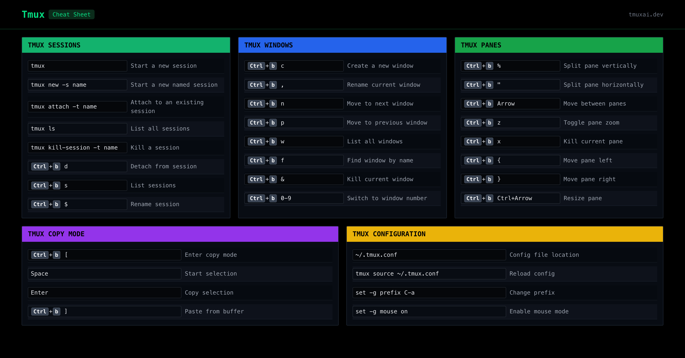

# Tmux Configuration

Minimal tmux setup optimized for macOS + iTerm2 with Neovim true color support.

## Requirements

- tmux >= 3.1
- [TPM](https://github.com/tmux-plugins/tpm) (Tmux Plugin Manager)

## Installation

```bash
mkdir -p ~/.config/tmux
# Place tmux.conf in this directory, then start tmux
tmux
```

### Plugin Manager (TPM)

Plugins are declared in `tmux.conf` via `set -g @plugin '...'` and installed/managed through TPM.

```bash
# Clone TPM (one-time setup)
git clone https://github.com/tmux-plugins/tpm ~/.tmux/plugins/tpm
```

| Shortcut     | Action                                    |
| ------------ | ------------------------------------------ |
| `Ctrl+b` `I` | Install new plugins listed in `tmux.conf` |
| `Ctrl+b` `U` | Update installed plugins                   |
| `Ctrl+b` `alt+u` | Remove/uninstall plugins no longer in `tmux.conf` |

---

## Plugins

| Plugin                                                              | Purpose                                                                                          |
| --------------------------------------------------------------------- | ------------------------------------------------------------------------------------------------- |
| [`tmux-menus`](https://github.com/jaclu/tmux-menus)                    | Popup menus for common tmux actions (panes, windows, sessions) without memorizing every shortcut |
| [`tmux-agent-sidebar`](https://hiroppy.github.io/tmux-agent-sidebar/) | Sidebar for managing AI coding agents (Claude Code) — agent status, git worktrees, activity log  |

### Tmux Menus

Opens a popup menu with common tmux operations (pane/window/session management), useful when you don't remember a specific keybinding.

| Shortcut      | Action              |
| ------------- | ------------------- |
| `Ctrl+b` `\` | Open the menus popup |

Inside the popup, follow the on-screen key hints to select an action; `Esc` closes it.

### Agent Sidebar

Adds a sidebar pane that lists active agent sessions (Claude Code) across windows, plus a bottom panel with activity log / git status.

| Shortcut          | Action                                     |
| ----------------- | ------------------------------------------- |
| `Ctrl+b` `e`      | Toggle sidebar in the current window        |
| `Ctrl+b` `E`      | Toggle sidebar in all windows               |
| `j` / `↓`         | Move cursor down (sidebar focused)          |
| `k` / `↑`         | Move cursor up (sidebar focused)            |
| `h` / `←`         | Previous status filter                      |
| `l` / `→`         | Next status filter                          |
| `Tab`             | Rotate through status filters               |
| `Shift+Tab`       | Switch bottom panel tab (Activity ⇄ Git)   |
| `Enter`           | Jump to the selected pane                   |
| `r`               | Open repo filter popup                      |
| `n`               | Create a new worktree with an agent         |
| `x`               | Delete the selected spawned pane            |
| `Esc`             | Exit focus / dismiss popup                  |

> Default agent is Claude Code (`@agent-sidebar-default-agent` = `claude`). New worktrees are created under `.worktrees/` with branch prefix `agent/` — both configurable via tmux options.

---

## Keymaps

### Cheat Sheets

> **Note:** Pane resize shortcuts are customized — macOS Mission Control intercepts the default `Ctrl+Arrow` bindings, so `H/J/K/L` is used instead.



> Prefix key is the default: `Ctrl+b`

### Pane Management

| Shortcut         | Action                                             |
| ---------------- | -------------------------------------------------- |
| `Ctrl+b` `"`     | Split pane horizontally (top / bottom) _(default)_ |
| `Ctrl+b` `%`     | Split pane vertically (side by side) _(default)_   |
| `Ctrl+b` `x`     | Kill current pane                                  |
| `Ctrl+b` `z`     | Zoom / unzoom current pane (fullscreen toggle)     |
| `Ctrl+b` `q`     | Show pane numbers                                  |
| `Ctrl+b` `Space` | Cycle pane layouts                                 |

### Pane Navigation

| Shortcut        | Action                                     |
| --------------- | ------------------------------------------ |
| `Ctrl+b` `←↑↓→` | Move to pane in that direction _(default)_ |
| `Ctrl+b` `o`    | Cycle to next pane                         |

### Pane Resizing

> After pressing `Ctrl+b`, keep tapping H/J/K/L — the `-r` flag makes it repeatable.

| Shortcut     | Action                    |
| ------------ | ------------------------- |
| `Ctrl+b` `H` | Resize pane left 5 cells  |
| `Ctrl+b` `J` | Resize pane down 5 cells  |
| `Ctrl+b` `K` | Resize pane up 5 cells    |
| `Ctrl+b` `L` | Resize pane right 5 cells |

### Window Management

| Shortcut         | Action                     |
| ---------------- | -------------------------- |
| `Ctrl+b` `c`     | Create new window          |
| `Ctrl+b` `1`–`9` | Switch to window by number |
| `Ctrl+b` `n`     | Next window                |
| `Ctrl+b` `p`     | Previous window            |
| `Ctrl+b` `,`     | Rename current window      |
| `Ctrl+b` `&`     | Kill current window        |

### Session Management

| Shortcut     | Action                   |
| ------------ | ------------------------ |
| `Ctrl+b` `d` | Detach from session      |
| `Ctrl+b` `s` | List and switch sessions |
| `Ctrl+b` `$` | Rename current session   |

### Misc

| Shortcut     | Action                                 |
| ------------ | -------------------------------------- |
| `Ctrl+b` `r` | Reload config                          |
| `Ctrl+b` `[` | Enter scroll/copy mode (exit with `q`) |
| `Ctrl+b` `?` | Show all keybindings                   |
| `Ctrl+b` `:` | Open command prompt                    |

---

## Config Overview

| Setting         | Value                  | Description                                                                     |
| --------------- | ---------------------- | ------------------------------------------------------------------------------- |
| Mouse           | on                     | Click to select panes, scroll with wheel                                        |
| Base index      | 1                      | Windows and panes start at 1                                                    |
| Terminal        | tmux-256color          | True color for Neovim themes                                                    |
| Status position | bottom                 | Status bar at the bottom                                                        |
| Status left     | session name           | Session name in a Mauve block (Catppuccin `#cba6f7`)                            |
| Status center   | window list            | Inactive windows on Surface0 bg; active window on Mauve bg                      |
| Status right    | hostname · time · date | Hostname (Teal on Surface1) · HH:MM (dark on Blue) · Day DD Mon (dark on Peach) |
| Plugins         | tmux-menus, tmux-agent-sidebar | Managed via TPM, declared at the bottom of `tmux.conf`                          |

---

## Common Workflow

```bash
# Start a new session
tmux

# Create a side-by-side layout
Ctrl+b %      # split left/right
Ctrl+b "      # split top/bottom

# Navigate panes
Ctrl+b Arrow

# Zoom into a pane
Ctrl+b z      # fullscreen
Ctrl+b z      # back to normal

# Detach (session keeps running in background)
Ctrl+b d

# Reattach later
tmux attach
```
